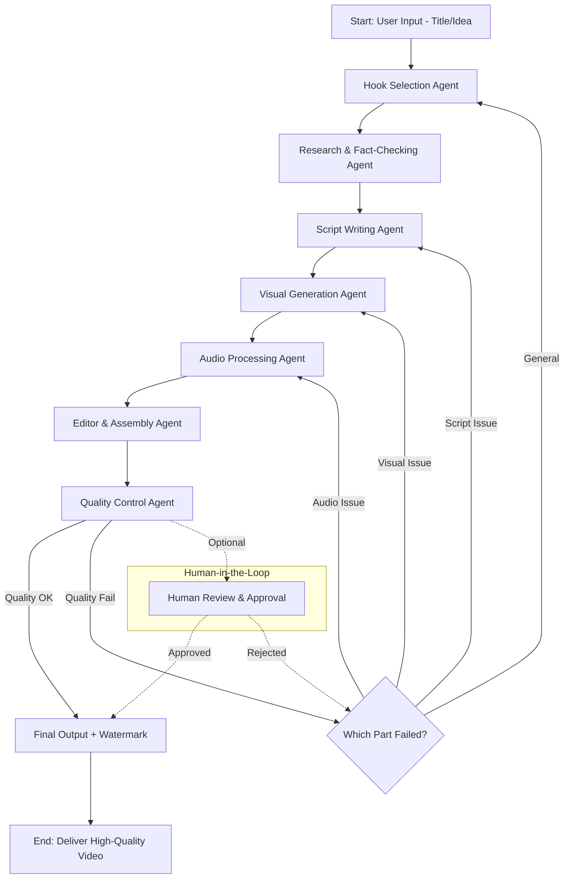

# مخطط LangGraph لنظام V6 CORE

## الرؤية
تصميم تدفق عمل (Workflow) باستخدام LangGraph يربط جميع الوكلاء المتخصصين في استوديو V6 CORE السينمائي الذكي.

## المخطط العام (Mermaid Diagram)



## شرح العقد (Nodes)

| العقدة (Node)                  | الوكيل المسؤول                  | الوظيفة الرئيسية                              | الأدوات المستخدمة                  |
|--------------------------------|--------------------------------|-----------------------------------------------|-------------------------------------|
| Hook Selection Agent           | Hook Agent                     | اختيار أقوى هوك للفيديو                       | LLM + Analysis                      |
| Research & Fact-Checking Agent | Research Agent                 | البحث والتحقق من الحقائق                     | Web Search + RAG + Fact-check tools |
| Script Writing Agent           | Script Agent                   | كتابة سكريبت واقعي نفسي/تاريخي               | LLM + Templates                     |
| Visual Generation Agent        | Visual Agent                   | توليد وتحسين اللقطات (Color Grading, LUTs)   | bridge_v10 + AI Video Models        |
| Audio Processing Agent         | Audio Agent                    | معالجة الصوت (Ducking, Effects, Voice)       | bridge_v7 + v8                      |
| Editor & Assembly Agent        | Editor Agent                   | المونتاج والربط النهائي                      | FFmpeg + Editing Logic              |
| Quality Control Agent          | Quality Agent                  | التدقيق الآلي والتصحيح قبل الإخراج           | Automated Checks + VMAF + CLIP      |

## الحواف الشرطية (Conditional Edges)
- **Quality OK** → Final Output
- **Quality Fail** → إعادة التوجيه إلى الوكيل المسؤول (Visual / Script / Audio)
- **Human-in-the-Loop** (اختياري) → مراجعة بشرية قبل الإخراج النهائي

## المميزات في هذا التصميم
- **تدفق ذكي**: يعود للخلف فقط عند الحاجة (لا يعيد كل شيء من البداية).
- **قابلية التوسع**: يمكن إضافة وكلاء جدد بسهولة.
- **جودة مضمونة**: Quality Gate في النهاية.
- **استمرارية**: يدعم Checkpointing في LangGraph.
- **تفاعل بشري**: Human-in-the-loop مدمج.

## كيفية التنفيذ
```python
from langgraph.graph import StateGraph, END

# تعريف الحالة (State)
class V6State:
    topic: str
    hook: str
    script: str
    clips: list
    audio: str
    final_video: str
    quality_status: str

# بناء الـ Graph
workflow = StateGraph(V6State)

workflow.add_node("hook", hook_agent)
workflow.add_node("research", research_agent)
# ... إضافة باقي العقد

workflow.set_entry_point("hook")
workflow.add_edge("hook", "research")
# ... إضافة الحواف الشرطية

app = workflow.compile()
result = app.invoke({"topic": "Psychology of Ancient Egyptian Pharaohs"})
```

هذا المخطط يمثل الأساس لهندسة الوكلاء المستقلين في V6 CORE.